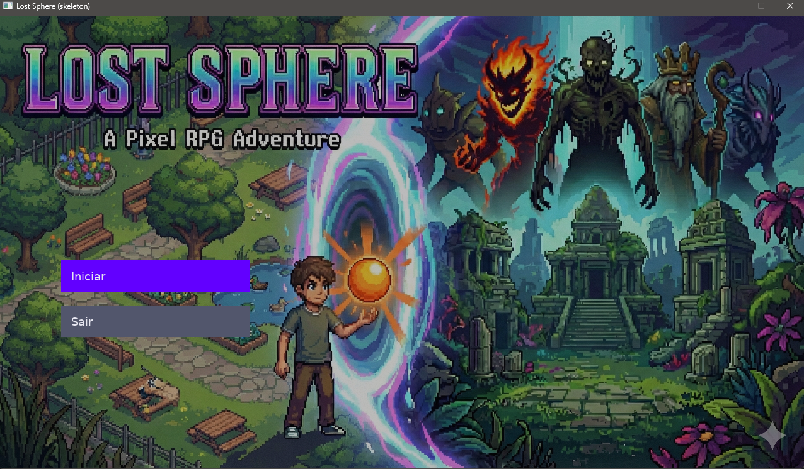
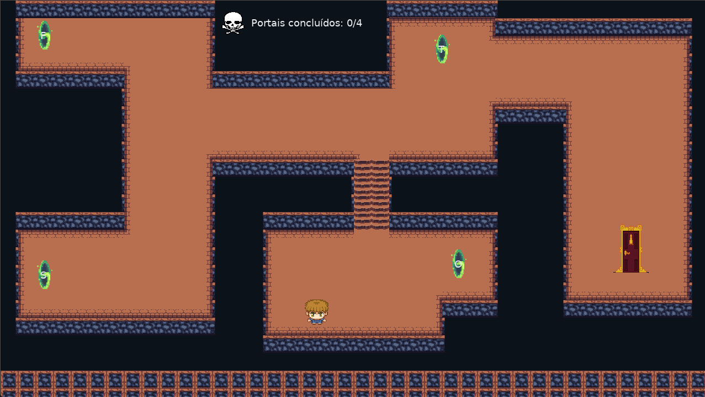
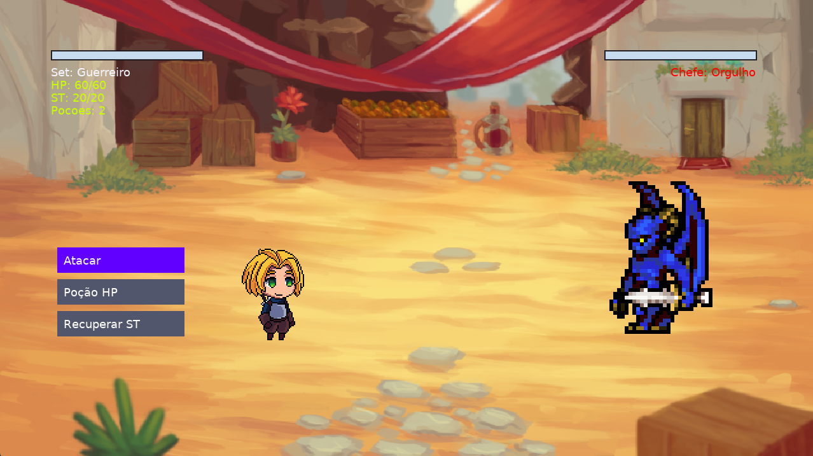

# TÍTULO: Lost Sphere

## DESCRIÇÃO:
Lost Sphere é um RPG 2D em pixel art que combina exploração top-down com batalhas por turnos. O jogador controla um garoto transportado para um mundo estranho após perder sua bola. Para voltar para casa, precisa derrotar quatro chefes: Fúria, Silêncio, Orgulho e Tempo. Cada um guardando parte do poder que mantém o portal aberto. O ciclo central do jogo é: explorar o mapa, encontrar um portal ativo, escolher um set (Guerreiro, Mago ou Caçador) e enfrentar o chefe daquela arena.

As batalhas seguem um sistema de turno simples: o jogador pode Atacar, Usar Poção ou Recuperar ST. Cada set tem dois golpes exclusivos com custos e danos diferentes. A gestão de stamina e o entendimento do padrão do chefe geram a profundidade estratégica. A vitória remove o portal do mapa, e a derrota faz o jogador tentar novamente.

O jogo termina quando os quatro chefes são derrotados, reabrindo o portal final. A dificuldade vem da escolha correta do set, da administração de stamina e do aprendizado dos padrões de ataque de cada boss, como o dano crescente do Silêncio ou o auto-dano do Fúria.

## SCREENSHOTS

figura 1. Menu Inicial

figura 2. Mapa

figura 3. Combate

## FUNCIONALIDADES A SEREM TESTADAS

### Condições de Vitória e Derrota
* Vitória marca o portal como concluído (GameState).
* Contador de portais concluídos atualiza no HUD.
* Porta final abre somente quando 4 portais foram concluídos.

### Comportamento dos Bosses
* Padrão de ataque único de cada boss está funcionando.
* Boss muda para estado ENRAGE quando aplicável (e troca sprite).
* Ataque do boss causa dano correto ao jogador.
* Boss morre quando HP chega a zero e ativa cena de vitória.

### Mecânica dos Ataques
* Dano correto para cada habilidade.
* VFX correspondentes: Slash, Projectile, Buff.
* Sons específicos por tipo (sword/spell/bow).

### Navegação e Exploração no Overworld
* Movimento do personagem (fluidez, resposta aos controles, velocidade).
* Detecção de colisões com paredes, objetos e limites do mapa.
* Entrada nos portais quando próximos (prompt “Aperte E”).
* Funcionamento da porta final após derrotar os quatro chefes.
* Exibição correta dos overlays de história (Introdução e Final).

### Sistema de Recursos (HP, ST, Poções)
* Consumo correto de ST ao usar habilidades.
* Impedir ataque quando ST insuficiente (exibir mensagem).
* Poção cura somente HP e só se houver quantidade disponível.
* Recuperar ST aumenta o recurso corretamente.
* Barra de HP/ST atualiza no ritmo certo.

## Créditos

#### Arthur Henrique Secundino Ferreira - 2020054200
#### Rodrigo Viana Souza - 2020054803
